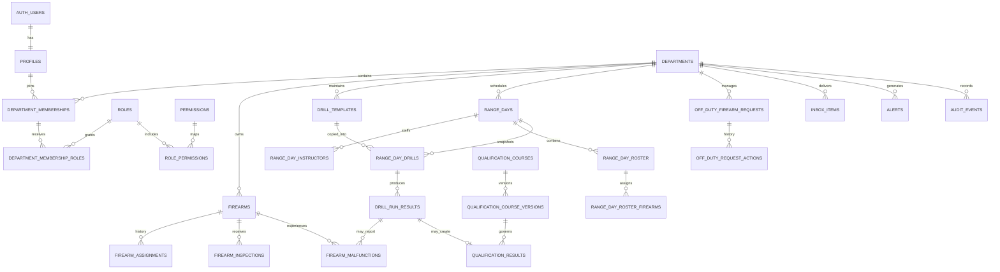

# TracePoint backend data model

## Design rules

- Every operational record is scoped to a `department_id`.
- Child records carry `department_id` and use composite foreign keys where cross-tenant integrity matters.
- Row Level Security checks active department membership and permissions.
- Drill templates are copied into `range_day_drills`; later template edits do not alter historical records.
- Firearm assignments are historical records rather than a single mutable `assignedOfficerId`.
- A user may hold multiple roles in one department.
- Audit events are written by database triggers rather than trusted to browser code.
